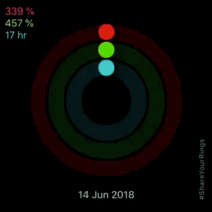

  

Share animated GIFs and Videos of your Activity Rings with your friends. 
Brag about how many loops each ring does. 
Show off in a more interesting way than just static images. 

 
# Share Your Rings

  

This app allows you to quickly export a GIF or Video of your Apple Watch Activity Rings animating. 

It was rejected from the App Store, so it's here of you want to build it yourself. 

It is not the most elegant code base, the app was hacked together in a night or two. But it works! 

----

Made by [Pat Murray](https://patmurray.co)   
[@\_patmurray](https://twitter.com/_patmurray)

----

### License?

This app is under a modified version of the MIT License. You can read the license [here](LICENSE).

The changes distill down to: 
- **Don't share the app as-is without modification**. 
- **Don't use any of my original art in your modifications and distributions**.

If you have a health app and want to use this in the app, go ahead :) that woudl be awesome! If you want to build an app around this as the core, that also fine; but you'll need to come up with your own branding. 

Cheers!
